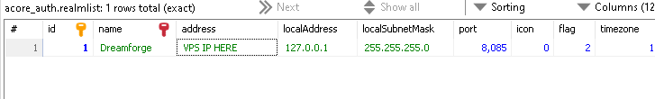

---

# FRP Server Setup Guide

**by Dr3amforg3**

This guide will help you set up FRP (Fast Reverse Proxy) on both a Linux VPS (like Ubuntu) and Windows, creating a tunnel for your server's communication.

---

## **Linux Setup**

### 1. **Set Up FRP Server on Linux VPS (Ubuntu)**

Run the following commands one by one.

Keep local version files when asked.


```sh
sudo apt update && sudo apt upgrade -y
```


 
```sh
nano install_tunel.sh
```

Copy and Paste this inside:

```sh
#!/bin/bash

# Prompt for FRP dashboard username and password
echo "Enter FRP Dashboard username:"
read dashboard_user
echo "Enter FRP Dashboard password:"
read -s dashboard_pwd

# Display the system user and dashboard user
echo "Current system user: $USER"
echo "Dashboard user: $dashboard_user"

# Update and install FRP dependencies
sudo apt update && sudo apt upgrade -y

# Download FRP
wget https://github.com/fatedier/frp/releases/download/v0.62.0/frp_0.62.0_linux_amd64.tar.gz
tar -xzf frp_0.62.0_linux_amd64.tar.gz
cd frp_0.62.0_linux_amd64

# Create frps.ini with user inputs
cat <<EOL > frps.ini
[common]
bind_port = 7000
dashboard_port = 7500
dashboard_user = $dashboard_user
dashboard_pwd = $dashboard_pwd
token = supersecret
EOL

# Move FRP files to the user's home directory
mkdir -p /home/$USER/frp_0.62.0_linux_amd64
mv * /home/$USER/frp_0.62.0_linux_amd64/

# Create systemd service for FRP using the system's current user ($USER)
sudo cat <<EOL > /etc/systemd/system/frps.service
[Unit]
Description=FRP Server Service
After=network.target

[Service]
User=$USER
WorkingDirectory=/home/$USER/frp_0.62.0_linux_amd64
ExecStart=/home/$USER/frp_0.62.0_linux_amd64/frps -c /home/$USER/frp_0.62.0_linux_amd64/frps.ini
Restart=on-failure

[Install]
WantedBy=multi-user.target
EOL

# Reload systemd, enable, and start the service
sudo systemctl daemon-reload
sudo systemctl enable frps
sudo systemctl start frps

echo "FRP server setup complete. Service started."

```


(Press `Ctrl+X`, then `Y`, and hit `Enter` to save the file.)


```sh
chmod +x install_tunel.sh
```

```sh
./install_tunel.sh
```


### 2. **Open Necessary Ports on Your VPS**

You need to open the following ports in your VPS network settings:

- **7000**: FRP communication
- **3724**: Authentication TCP
- **8085**: World TCP

You may need to adjust your VPS firewall or use the provider's control panel to allow these ports.

---

## **Windows Setup**

### 1. **Download FRP for Windows**

Download the latest release for Windows from the link below. Note that it might show a virus protection warning due to its tunneling nature. Allow the download and proceed with the setup.

[Download FRP for Windows](https://github.com/fatedier/frp/releases/download/v0.62.0/frp_0.62.0_windows_amd64.zip)

---

### 2. **Create `frpc.ini` File**

In the same folder as `frpc.exe`,  create a new file called `frpc.ini` and paste the following configuration:

```
[common]
server_addr = YOUR.VPS.IP
server_port = 7000
token = supersecret

[auth_tcp]
type = tcp
local_ip = 127.0.0.1
local_port = 3724
remote_port = 3724

[world_tcp]
type = tcp
local_ip = 127.0.0.1
local_port = 8085
remote_port = 8085
```

Replace `YOUR.VPS.IP` with your VPS's actual IP address.


---

### 3. **Start FRP**

Open CMD , change directory to FRP folder with command: 
```
CD C:\Users\Administrator\Desktop\frp_0.62.0_windows_amd64   <--- Replace this with Your directory !!!
```
than run command :
```
frpc.exe -c frpc.ini
```

---

### 4. **Configure Realmlist**

Finally, in your WoW server's database, set the `realmlist` IP address to your VPS's IP.



---

